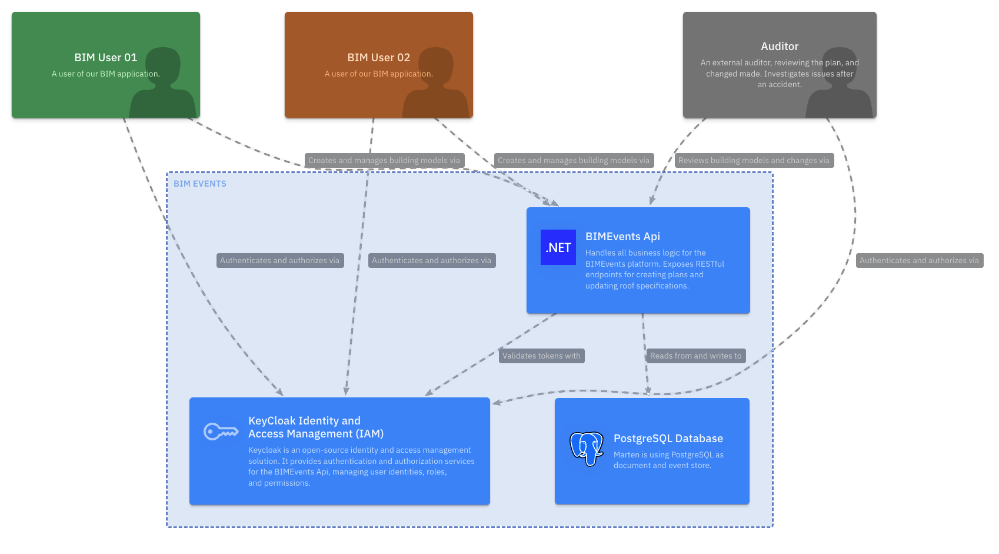
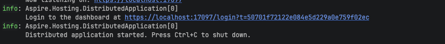
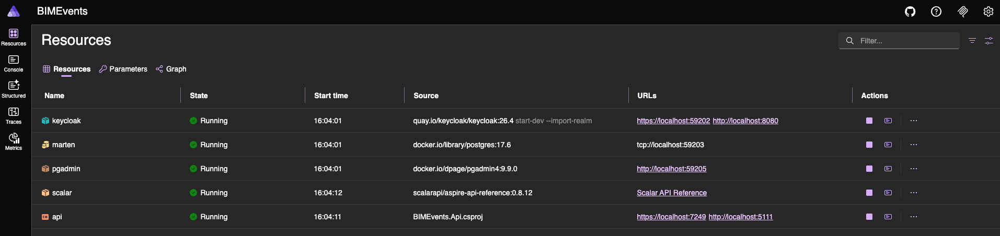

# Event Sourcing With Marten

This is an example application, demonstrating how to implement event sourcing using the Marten library in .NET. It is part of a blog post, which can be found [here](https://blog.duijzer.com/posts/event-sourcing-with-dotnet-and-marten/).

## Prerequisites

- [.NET 10 SDK](https://dotnet.microsoft.com/en-us/download/dotnet/10.0)
- [Docker](https://www.docker.com/get-started)
- [Visual Studio Code](https://code.visualstudio.com/) (optional, for http calls with REST Client extension)

## The Application: BIMEvents



## Getting Started

1. Clone the repository
2. Navigate to the project directory
3. Start Aspire:
    ```bash
    dotnet run --project src/BIMEvents.AppHost/BIMEvents.AppHost.csproj
    ```
4. The console will show the link to the Aspire dashboard, click on the link to open the dashboard:
    
5. The Aspire Dashboard will open in your browser. Wait for all services to be started:
    

## Testing the application

The easiest way to test the application is by using the REST Client extension in Visual Studio Code. Open the `calls-vscode.http` file located in the root folder and execute the requests one by one. The `calls.http` file can also be used in JetBrains Rider.

A good flow for testing:
1. Authenticate with bimuser01
2. Create a new plan
3. Update the roof specification
4. Get the plan (should have the latest specification)
4. Authenticate with bimuser02
5. Update the roof specification
6. Get the plan (should have the latest specification)
7. Get the plan activity (should show all changes made to the plan)

## Added flow: historic data seeding

To show a more time-based event sourcing example, a data seeding flow has been added. This flow creates a plan and makes multiple changes to it, each with a different timestamp in the past. This allows you to see how the plan evolved over time.

It is easy to see how this works. 

1. Start the project, wait until all Aspire services are running.
2. Open the Scalar OpenApi dashboard by clicking the link in the Aspire dashboard.
3. Execute the 'GET /plan/all' and copy the id of a plan.
4. Execute the 'GET /plan/activity/{id}' request with the copied id.


